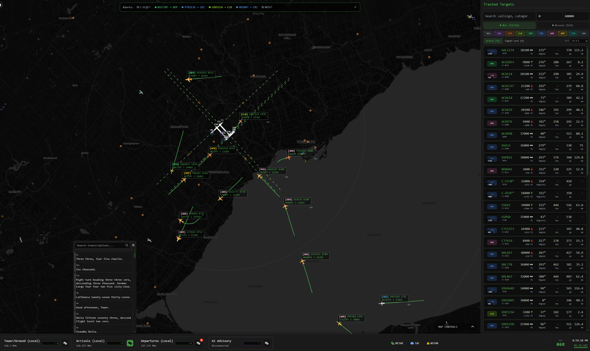
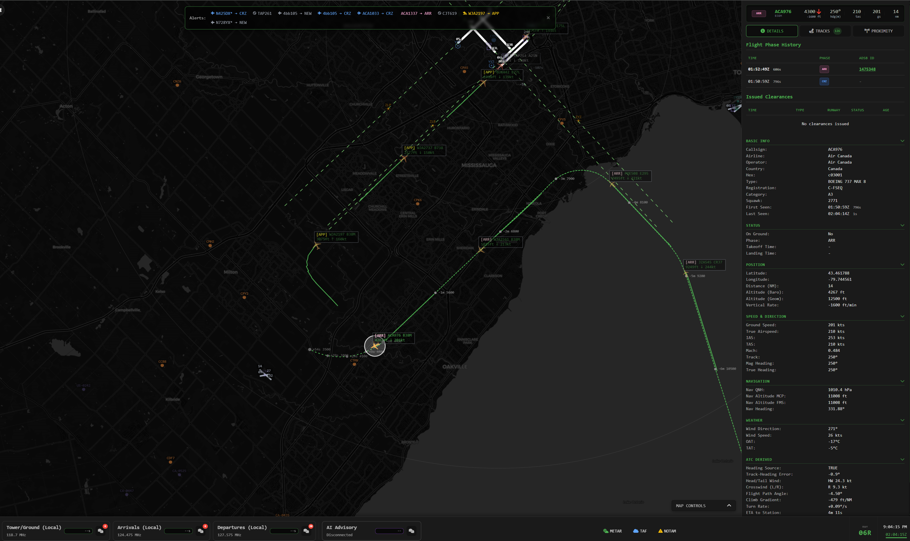
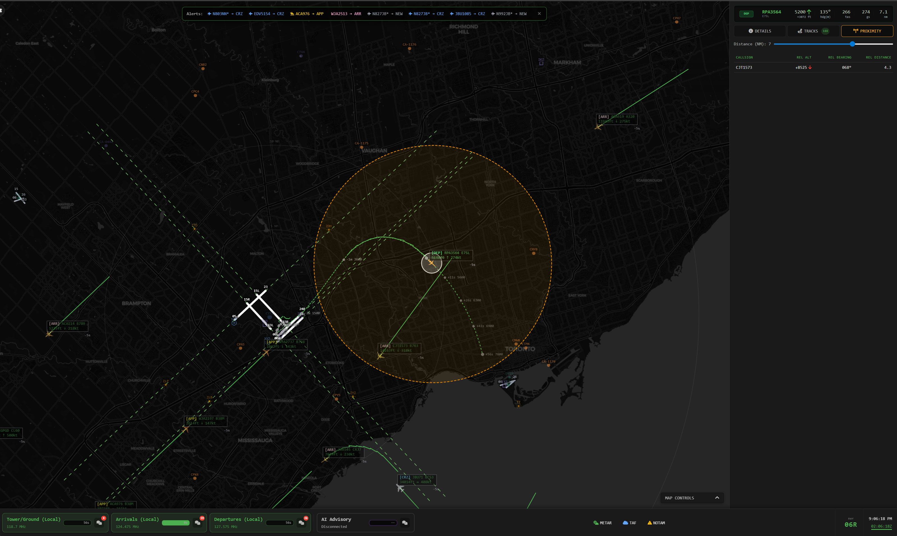
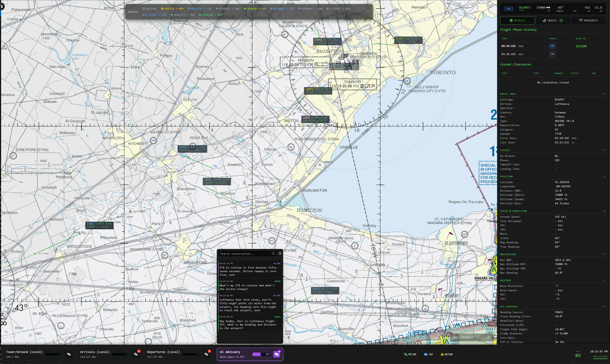
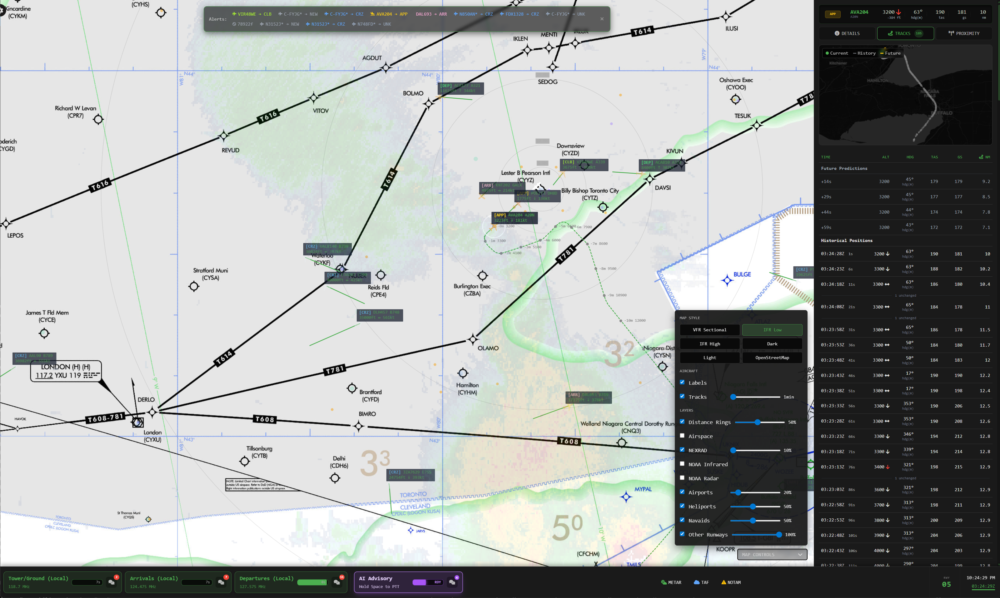

# Co-ATC: Aircraft Monitoring System

Co-ATC is an AI-enhanced system designed to monitor airspace activity, supporting (imaginary) ATC operations. It integrates real-time ADSB data (local or remote), streams ATC communications (local VHF radio or LiveATC) while leveraging AI to transcribe and interpret communications, track ATC instructions, and generate alerts for potential conflicts or non-compliance.











## What Co-ATC Does

Co-ATC provides air traffic controllers and aviation enthusiasts with:

- **Real-time Aircraft Tracking**: Live visualization of aircraft positions, flight paths, and telemetry data
- **Interactive Map Interface**: Comprehensive airspace view with aircraft details, weather overlays, and runway information
- **Use Local Data Sources**: Connects to your ADSB and [VHF band](https://github.com/rtl-airband/RTLSDR-Airband/pull/523) SDRs for mostly local (offline) tracking
- **AI-Powered Voice Assistant**: Voice-based ATC assistant with comprehensive airspace knowledge and real-time context (OpenAI API key required)
- **Audio Transcription**: Real-time transcription and analysis of ATC communications using AI (OpenAI API key required)
- **Flight Phase Detection**: Automatic detection and tracking of aircraft flight phases (taxi, takeoff, departure, cruise, arrival, approach, touchdown)
- **ATC Clearance Extraction**: AI-powered extraction and tracking of takeoff, landing, and approach clearances (OpenAI API key required)
- **Aircraft Simulation**: Create and control simulated aircraft for training and testing scenarios
- **Weather Integration**: Live METAR, TAF, and NOTAM data integration (using "stolen" Windy APIs - sorry!)
- **Alert System**: Real-time notifications for aircraft status changes and potential issues (incomplete)

## Current State

Co-ATC is in semi-active development with core functionality implemented and operational. The system successfully processes real-time ADS-B data, provides interactive map visualization, transcribes ATC communications, and offers AI-powered assistance (airport advisory services). 

For detailed progress and implementation specifics, see [Project Specification and Progress](docs/project_progress.md).

### ⚠️ SECURITY WARNING

**DO NOT EXPOSE THIS APPLICATION TO THE INTERNET**

This application is designed for local use only and should never be made accessible from the internet. It has:

- **No authentication system** - Anyone with access can use all features
- **No authorization controls** - All functionality is available to any user
- **No security hardening** - Built for development and local use
- **AI-generated codebase** - Has not undergone professional security review or testing

## Requirements

- **Go 1.21 or higher** - To build the project
- **ADS-B Data Source** - Access to ADS-B data (e.g., local `tar1090` server or external API)
- **FFmpeg** - Audio processing for radio frequency streams (see installation instructions below)
- **Modern Web Browser** - Chrome, Firefox, Safari, or Edge for the web interface
- **OpenAI API Key** - Only needed for AI Advisory, radio transcriptions, and clearance extraction

### Installing FFmpeg

#### Windows
1. **Using Chocolatey** (recommended):
   ```powershell
   # Install Chocolatey if not already installed
   Set-ExecutionPolicy Bypass -Scope Process -Force; [System.Net.ServicePointManager]::SecurityProtocol = [System.Net.ServicePointManager]::SecurityProtocol -bor 3072; iex ((New-Object System.Net.WebClient).DownloadString('https://community.chocolatey.org/install.ps1'))
   
   # Install FFmpeg
   choco install ffmpeg
   ```

2. **Manual Installation**:
   - Download FFmpeg from [https://ffmpeg.org/download.html#build-windows](https://ffmpeg.org/download.html#build-windows)
   - Extract the archive to `C:\ffmpeg`
   - Add `C:\ffmpeg\bin` to your system PATH environment variable
   - Restart your command prompt/PowerShell

#### Mac
1. **Using Homebrew** (recommended):
   ```bash
   # Install Homebrew if not already installed
   /bin/bash -c "$(curl -fsSL https://raw.githubusercontent.com/Homebrew/install/HEAD/install.sh)"
   
   # Install FFmpeg
   brew install ffmpeg
   ```

2. **Using MacPorts**:
   ```bash
   sudo port install ffmpeg
   ```

#### Verify Installation
After installation, verify FFmpeg is working:
```bash
ffmpeg -version
```

## Installation and Setup

### Option 1: Download Pre-compiled Binaries

The quickest way to get Co-ATC running is to download pre-compiled binaries from the releases page.

1. **Download the latest release** from [GitHub Releases](https://github.com/yegors/co-atc/releases)
2. **Clone the repository** (required for assets and www folders):
   ```bash
   git clone https://github.com/yegors/co-atc.git
   cd co-atc
   ```
3. **Extract the binary** to the project root directory
4. **Proceed to Configuration** section below

### Option 2: Build from Source

If you prefer to build from source or need to modify the code:

#### Windows
```powershell
# Clone the repository
git clone https://github.com/yegors/co-atc.git
cd co-atc

# Install dependencies
go mod download

# Build the application using the build script
.\build_windows.ps1
```

#### Mac
```bash
# Clone the repository
git clone https://github.com/yegors/co-atc.git
cd co-atc

# Install dependencies
go mod download

# Build the application using the build script (for macOS)
./build_mac.sh
```

#### Linux
```bash
# Clone the repository
git clone https://github.com/yegors/co-atc.git
cd co-atc

# Install dependencies
go mod download

# Build the application using the build script (auto-detects architecture)
chmod +x ./build_linux.sh
./build_linux.sh
```

### 2. Configuration

Copy the example configuration and customize for your environment:

#### Windows
```powershell
# Copy example configuration
copy configs\config.toml.example configs\config.toml

# Edit configuration file
notepad configs\config.toml
```

#### Mac/Linux
```bash
# Copy example configuration
cp configs/config.toml.example configs/config.toml

# Edit configuration file
nano configs/config.toml
```

#### Essential Configuration Settings

**Mandatory:**
- `[adsb].source_type` - Choose one source mode:
   - `tar1090` - base URL serving `aircraft.json`, `receiver.json`, `stats.json`
   - `readsb-api` - readsb HTTP API endpoint (e.g. `http://host:30152/?all`)
   - `readsb-file` - local readsb runtime files (auto-detected, optional `readsb_data_dir` override)
   - `external-rapidapi` - external ADS-B API using `external_source_url` + API host/key
   - `external-opensky` - OpenSky `/states/all` with optional OAuth2 client-credentials

- For `external-opensky` + OAuth2:
   - Set `opensky_auth_mode = "oauth2"`
   - Set `opensky_oauth2_credentials_path` to a JSON file shaped as `{"clientId":"...","clientSecret":"..."}`

**Optional but Recommended:**
- `[station]` - Configure your airport/station location (Toronto CYYZ example provided)
- `[[frequencies.sources]]` - Add your local radio frequencies for transcription (Toronto examples provided)
- `transcription.openai_api_key` - Enable AI transcription features (features disabled if not provided)
- `atc_chat.openai_api_key` - Enable AI voice assistant (features disabled if not provided)

The configuration file contains comprehensive documentation for all settings with examples for Toronto Pearson (CYYZ). You can use these as templates for your own location and frequencies.

**Note**: If OpenAI API keys are not provided, the application will start successfully but AI-powered features (transcription, post-processing, and voice assistant) will be disabled. Warning messages will be displayed during startup to indicate which features are unavailable.

### 3. Run the Application

```powershell
# Run the built executable
.\bin\co-atc.exe
```

The application will:
- Start the web server (default: http://localhost:8080)
- Begin processing ADS-B data
- Initialize audio streaming and transcription services
- Create daily SQLite database files automatically

### 4. Access the Interface

Open your web browser and navigate to `http://localhost:8080` to access the Co-ATC interface.

## Key Features

### Interactive Map (OpenLayers)
- OpenLayers map engine with real-time aircraft rendering
- Modular map architecture under `www/map/` (core, renderers, features, telemetry)
- Aircraft, trails, labels, selection/hover, proximity, and mini-map
- Basemap/chart styles: dark, light, OpenStreetMap, VFR sectional, terminal, IFR low, IFR high
- Supported overlays/layers: airports, runways, navaids, distance rings, weather radar/cloud, airspace overlays, and aviation chart overlay
- In-map controls for layer toggles/opacities and aircraft display behavior
- Overlay failure isolation and stable behavior under high aircraft load

### Aircraft Monitoring & ADS-B Sources
- Real-time aircraft telemetry with historical, hindcast, and future trajectories
- Flight phase tracking with trajectory-aware transitions and signal-loss handling
- Active runway detection from live approach/landing/departure evidence
- Data enrichment from local asset datasets (`assets/aircraft.csv`, `assets/airlines.dat`, `assets/airports.csv`, `assets/runways.csv`, `assets/navaids.csv`)
- Multiple source modes: `tar1090`, `readsb-api`, `readsb-file`, `external-rapidapi`, `external-opensky`

### AI + Audio Workflow
- Multi-frequency ATC stream ingestion and low-latency browser audio delivery
- Real-time transcription + optional AI post-processing and clearance extraction
- Voice ATC assistant with live airspace/context updates
- Transcription history and operational data exposed through REST + WebSocket

### Simulation & Operations
- Simulated aircraft with real-time control (heading/speed/vertical rate)
- Integration of simulation traffic into the same monitoring and alert pipelines
- Settings panel includes ADS-B source health and concise decoder metrics

## API Documentation

Co-ATC provides a comprehensive RESTful API for accessing aircraft data, frequency information, and transcriptions. For detailed API documentation, including endpoints, request parameters, and response formats, see the [API Specification](docs/api_spec.md).

## Technical Documentation

For detailed technical information about the system architecture, implementation details, and internal workings, see the [Technical Documentation](docs/technical_docs.md).

## Configuration Notes

- **Database**: SQLite databases are created daily as `co-atc-YYYY-MM-DD.db`
- **Static Files**: Web interface files served from configurable directory (default: `www`)
- **Audio Latency**: Optimized for low-latency streaming with configurable buffer sizes
- **Performance**: Supports high-frequency data updates with intelligent filtering and caching
